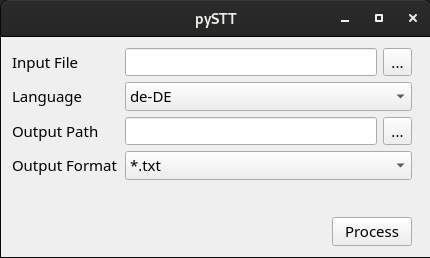

# pyToolbox

Within this repository a collection of simple tools for various purposes is
provided. Each section contains a summary of features and installation guides
for the tool at hand.

## Speech-to-Text



This tool provides a simple UI to process WAV files with Google's speech
recognition. The input file has to be selected from the file system by either
inserting the path to the text field _Input File_ or by selecting it manually by
clicking the button on the right.

Currently, selectable input languages are German (`de-DE`), English (`en-US`)
and Russian (`ru-RU`). The _Output Path_ has to be the directory where the
generated `txt` files are stored. The name of the file will be the same as the
input file.

The processing is started by clicking the _Process_ button.

### Installation

To install `pySTT` on a local computer make sure, this machine has Python 3.9 (
or higher) installed. After downloading the sources, set up a virtual
environment within the directory and install the requirements:

#### Unix/Linux

```sh
# create environment
python -m venv venv

# activate it
source venv/bin/activate

# install requirements
pip install -r requirements.txt
```

#### Windows

```bat
Rem create environment
python -m venv venv

Rem activate it
.\venv\Scripts\activate

Rem install requirements
pip install -r requirements.txt
```

**IMPORTANT:** To create the environment with `python`, Python must be
added properly to the PATH variable! If this is not the case, use the
argument `--python C:\Absolute\path\to\python.exe` instead. Where to find it is
described [here](https://mothergeo-py.readthedocs.io/en/latest/development/how-to/venv-win.html#where-s-my-python)
.

### Execution

After running the build scripts (`build.sh` on Unix and Linux, `build.bat`
on Windows), there is a directory called `dist/pySTT` created. In there lies the
executable `pySTT` or `pySTT.exe` (Windows) with all its dependencies.